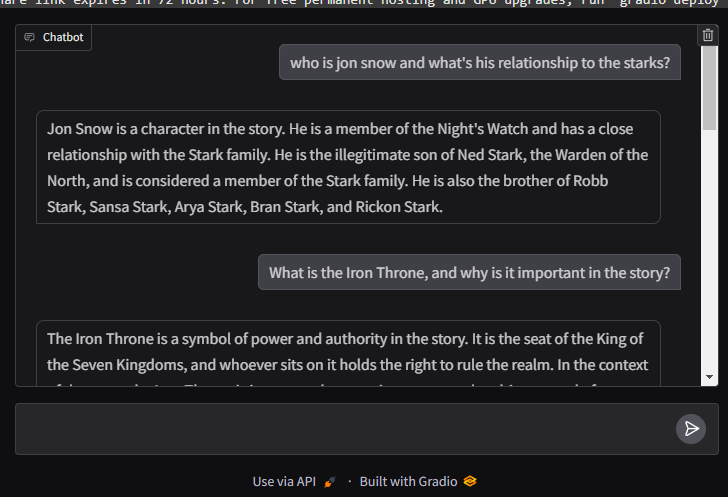
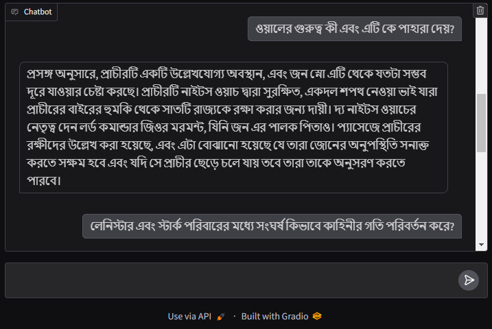
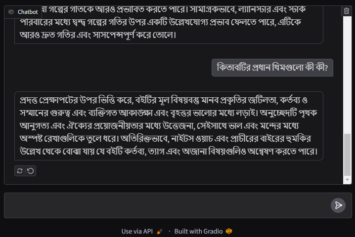

# AI_Chatbot

This is a Retrieval-Augmented Generation (RAG) Q&A system using the `llama-index` library and the **Meta LLaMA 3-8B Instruct model** from Hugging Face. It loads and indexes documents, retrieves relevant information based on user input, and generates responses. The system detects the language of the input (English or Bengali), processes it accordingly, and provides answers through a Gradio chat interface.

Colab Notebook: https://colab.research.google.com/drive/1IfY87SwvWkaQnz70I2AlIsriOkmsN8ig?usp=sharing

"A Game of Thrones" book pdf is loaded which the system querries. You can use any pdf document. The conversion with the chatbot is about the contents of the book.
Here are some examples of the Q/A chatbot for conversation in both bangla and english.
### Example 1

### Example 2

### Example 3

